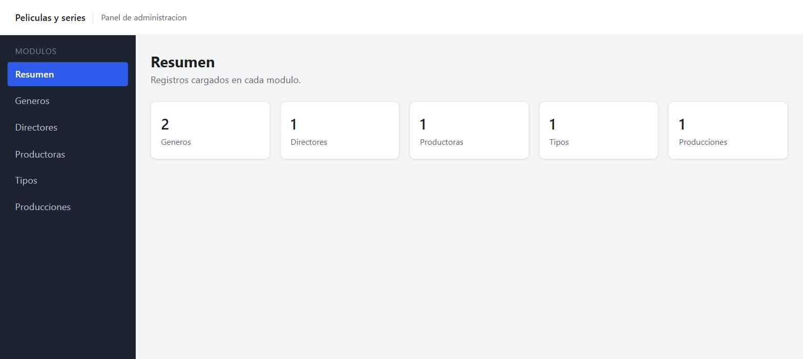
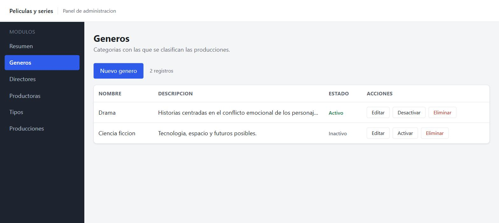
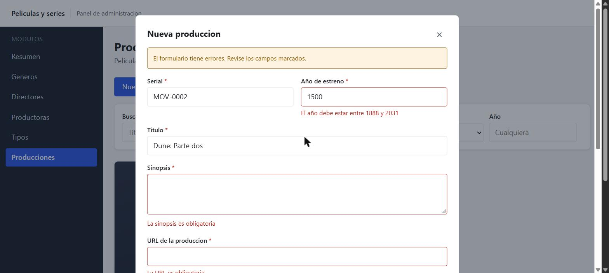
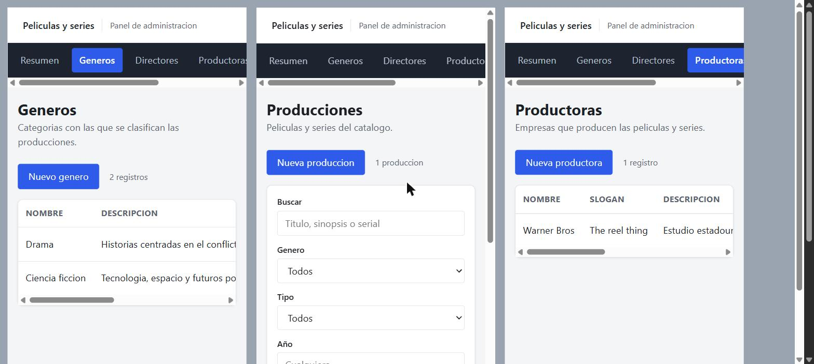

# Gestión de películas y series

Proyecto de **Ingeniería Web II** — IU Digital de Antioquia.

El repositorio es un monorepo con dos aplicaciones: la API REST y el panel web que la consume.

## Estructura

```
peliculas-monorepo/
├── package.json          <- workspaces y scripts de arranque
├── PLAN-FRONTEND.md      <- plan por etapas del frontend
├── docs/capturas/        <- capturas del panel
└── apps/
    ├── backend/          <- API REST (Node + Express + MongoDB)
    └── frontend/         <- panel de administración (React + Vite)
```

Las dependencias de las dos aplicaciones se instalan juntas en un único `node_modules` de la raíz, gracias a los *workspaces* de npm.

## Puesta en marcha

Una sola instalación desde la raíz, para todo el monorepo:

```bash
npm install
```

Después, cada aplicación necesita su archivo de variables de entorno:

```bash
copy apps\backend\.env.example apps\backend\.env
copy apps\frontend\.env.example apps\frontend\.env
```

En `apps/backend/.env` se ajusta `MONGO_URI` con la cadena de conexión a MongoDB. El `.env` del frontend ya apunta a la API local.

## Ejecución

Desde la raíz, en dos terminales distintas:

```bash
npm run dev:api     # API en http://localhost:3000
npm run dev:web     # panel en http://localhost:5173
```

Para comprobar que la API responde:

```
GET http://localhost:3000/health
```

`npm run start:api` arranca la API sin nodemon.

## Las dos aplicaciones

| Aplicación | Carpeta | Paquete | Documentación |
|---|---|---|---|
| API REST | `apps/backend` | `api-peliculas` | [README](apps/backend/README.md) |
| Panel web | `apps/frontend` | `frontend-peliculas` | [README](apps/frontend/README.md) |

El detalle del modelo de datos, los endpoints y los códigos de respuesta está en el README del backend. La estructura del panel y cómo traduce cada error de la API están en el README del frontend.

## El panel

Resumen con el número de registros de cada módulo:



Los cuatro catálogos comparten la misma pantalla: tabla, alta y edición en un modal, activar o desactivar y borrar.



El formulario de producciones valida antes de enviar y marca cada campo con su error. Los desplegables solo ofrecen géneros, directores y productoras activos.



En pantalla angosta la barra lateral pasa a una fila y las tablas se desplazan en horizontal.


