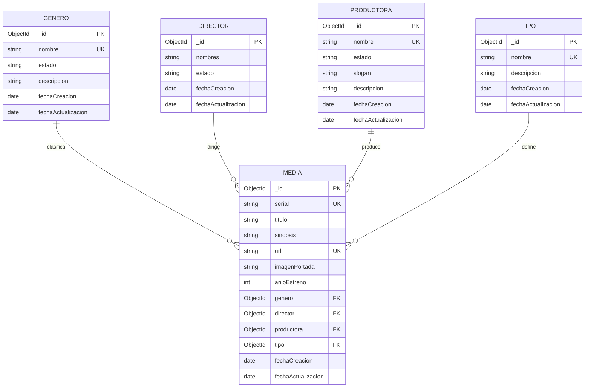

# Diseño de la base de datos

Motor: **MongoDB** (base de datos documental) con **Mongoose** como ODM.
Base de datos: `peliculas_db`

## Colecciones

### `generos`

| Campo | Tipo | Reglas |
|---|---|---|
| `_id` | ObjectId | PK generada por MongoDB |
| `nombre` | String | Obligatorio, único, máx. 100 |
| `estado` | String | `Activo` \| `Inactivo` (por defecto `Activo`) |
| `descripcion` | String | Opcional, máx. 500 |
| `fechaCreacion` | Date | Automática |
| `fechaActualizacion` | Date | Automática |

### `directores`

| Campo | Tipo | Reglas |
|---|---|---|
| `_id` | ObjectId | PK |
| `nombres` | String | Obligatorio, máx. 150 |
| `estado` | String | `Activo` \| `Inactivo` (por defecto `Activo`) |
| `fechaCreacion` | Date | Automática |
| `fechaActualizacion` | Date | Automática |

### `productoras`

| Campo | Tipo | Reglas |
|---|---|---|
| `_id` | ObjectId | PK |
| `nombre` | String | Obligatorio, único, máx. 150 |
| `estado` | String | `Activo` \| `Inactivo` (por defecto `Activo`) |
| `slogan` | String | Opcional, máx. 200 |
| `descripcion` | String | Opcional, máx. 500 |
| `fechaCreacion` | Date | Automática |
| `fechaActualizacion` | Date | Automática |

### `tipos`

| Campo | Tipo | Reglas |
|---|---|---|
| `_id` | ObjectId | PK |
| `nombre` | String | Obligatorio, único, máx. 100 |
| `descripcion` | String | Opcional, máx. 500 |
| `fechaCreacion` | Date | Automática |
| `fechaActualizacion` | Date | Automática |

> El caso de estudio no pide estado para este módulo, por eso no se incluye.

### `medias`

| Campo | Tipo | Reglas |
|---|---|---|
| `_id` | ObjectId | PK |
| `serial` | String | Obligatorio, **único** |
| `titulo` | String | Obligatorio, máx. 200 |
| `sinopsis` | String | Obligatoria, máx. 2000 |
| `url` | String | Obligatoria, **única**, formato URL |
| `imagenPortada` | String | Obligatoria, formato URL |
| `anioEstreno` | Number | Obligatorio, entre 1888 y el año actual + 5 |
| `genero` | ObjectId → `generos` | Obligatorio, **solo géneros Activos** |
| `director` | ObjectId → `directores` | Obligatorio, **solo directores Activos** |
| `productora` | ObjectId → `productoras` | Obligatorio, **solo productoras Activas** |
| `tipo` | ObjectId → `tipos` | Obligatorio, debe existir |
| `fechaCreacion` | Date | Automática |
| `fechaActualizacion` | Date | Automática |

## Diagrama entidad-relación

## Reglas de negocio implementadas

1. Una producción se clasifica en **un único** género (relación 1:N desde Género).
2. Una producción tiene **un único** director principal y **una única** productora principal.
3. Al crear o editar una producción, la API rechaza (HTTP 400) cualquier género, director o productora que esté en estado `Inactivo`, y cualquier referencia que no exista.
4. `serial` y `url` no se pueden repetir entre producciones (HTTP 409 si se intenta).
5. Los módulos con estado permiten desactivar registros con `PATCH /:id/estado` (borrado lógico) sin perder la información histórica.
